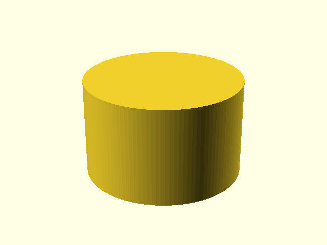
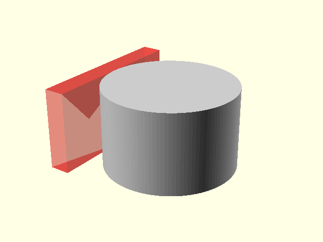
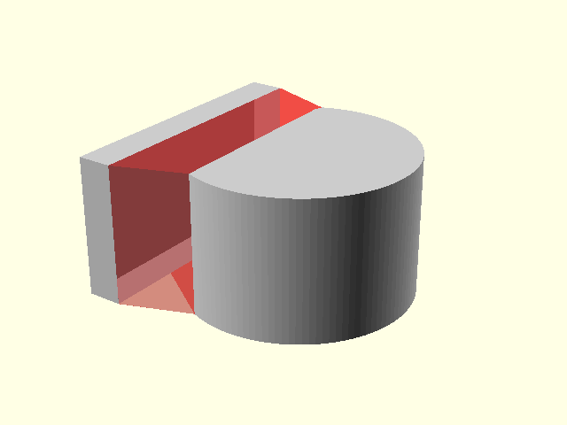
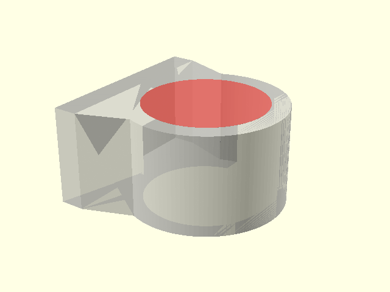
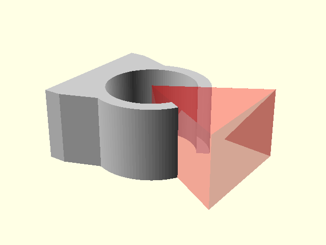
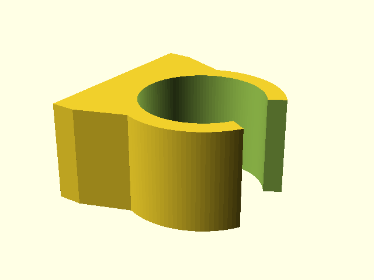

# Tube clamp — OpenSCAD design


## Goal of the base clip

This component is the reusable **basic tube clip**, not yet a complete mounting
solution.

The clip therefore gets only a compact flat back. That flat surface is part of
the clip shape itself and does **not** extend sideways into a mounting plate.

A later consumer or library variant can decide how the clip is actually
mounted, for example with one screw below the tube or with an extended plate
and two screw holes.

For the base clip the rule is simple:

> the flat base is exactly as wide as the lower edge of the sloped transition.

There is therefore no independent base-width or mounting-plate-width parameter.

## Main parameters

Tube geometry:

```scad
tube_diameter = 20;
clearance = 0.0;
tension_diameter = undef;
wall_thickness = 3;
clamp_width = 16;
opening_angle = 60;
extra = 0.01;
```

The nominal/visual bore is the **functional diameter**:

```text
functional_diameter = tube_diameter + clearance
```

For a real clamping print an optional smaller `tension_diameter` can be supplied.
The public build/render call selects which bore is cut. The outside of the ring
does not shrink with the tension bore; it remains based on the functional
diameter plus `wall_thickness`.

`extra` is only a tiny Boolean overlap/extension used to make unions and
differences robust. It is not fit clearance and does not move the nominal tube
or ring centre.

Compact back geometry:

```scad
base_thickness = 4;
transition_width = 30;
transition_depth = 8;
```

- `base_thickness` — thickness measured from the flat rear surface toward the
  clip;
- `transition_width` — total width of both the compact base and the lower edge
  of the sloped transition;
- `transition_depth` — distance from the front of the compact base toward the
  circular body before the transition meets the circle.

The base width is deliberately derived from `transition_width`.

The circular body is positioned from the nominal base thickness. Earlier
versions moved the complete circle 1 mm into the base to force a Boolean
overlap. That changed the visible profile. The current geometry keeps the
physical datum clean and uses only `extra` for the tiny overlap needed by the
union.

## Construction order

The model is built as an ordinary solid part:

```text
complete outside shape
        ↓
remove tube bore
        ↓
remove snap opening
        ↓
final clip
```

The tube bore is therefore **one Boolean cut through the completed outside
shape**. It is not cut from the ring and then cut a second time from the
transition.

The design images follow exactly this order.

## 1. Solid circular outside

We start with the solid outside cylinder of the clip. There is intentionally no
tube hole yet.

```scad
module _outer_ring_solid(clamp) {
    translate([_tube_clamp_center_x(clamp), 0, 0])
        cylinder(
            h = clamp.clamp_width,
            r = tube_clamp_outer_radius(clamp)
        );
}
```



## 2. Compact flat base

The flat rear surface is added next. Existing geometry is gray; new geometry is
transparent red.

```scad
module _flat_base(clamp) {
    translate([
        0,
        -clamp.transition_width / 2,
        0
    ])
        cube([
            clamp.base_thickness + clamp.extra,
            clamp.transition_width,
            clamp.clamp_width
        ]);
}
```

The important part is that the base uses `transition_width` directly. It cannot
stick out farther than the transition underneath it.



## 3. Sloped transition

The transition joins the compact base to the round outside.

```scad
polygon(points = [
    [clamp.base_thickness, -base_half_width],
    [clamp.base_thickness,  base_half_width],
    [attach_x,               attach_y],
    [attach_x,              -attach_y]
]);
```

At the end of this step the complete outside is one solid union:

```scad
module _outer_shape(clamp) {
    union() {
        _outer_ring_solid(clamp);
        _flat_base(clamp);
        _base_transition(clamp);
    }
}
```

No holes have been made yet.



## 4. Tube bore

Now the cylindrical space for the tube is removed from that completed outside.

The outside is shown semi-transparent gray and the cutter is red. The same
outside can use either the nominal/visual bore or the smaller print-clamping
bore:

```scad
tube_clamp_build(
    clamp,
    use_tension_bore = false
); // functional/visual diameter

tube_clamp_build(
    clamp,
    use_tension_bore = true
); // tension diameter when configured
```

This remains the only tube-bore subtraction in the construction.



## 5. Snap opening

The hollow body is still closed. The triangular cutter creates the snap
opening.

```scad
cutter_length = outer_r + 10;
cutter_half_width =
    cutter_length * tan(clamp.opening_angle / 2);
```



## 6. Final base clip

The public build is now a direct expression of the design sequence:

```scad
module tube_clamp_build(
    clamp,
    use_tension_bore = true,
    high_resolution = true
) {
    difference() {
        _outer_shape(clamp);

        _inner_bore_cutter(
            clamp,
            use_tension_bore
        );
        _opening_cutter(clamp);
    }
}
```

The result has a useful compact flat back but still makes no assumptions about
how a project will fasten it.



## 7. Profile view

The profile view looks directly along the clamp width and is intended for
judging:

- `base_thickness`;
- `transition_width`;
- `transition_depth`;
- the nominal relationship between the circular body and compact base;
- the tiny `extra` overlap used only for robust Boolean construction.


## Public object API

```scad
clamp = tube_clamp_create(
    tube_diameter = 10,
    clearance = 0.0,
    tension_diameter = 9.6,
    wall_thickness = 2,
    clamp_width = 16,
    opening_angle = 60,
    base_thickness = 2,
    transition_width = 12,
    transition_depth = 3,
    extra = 0.01
);

tube_clamp_build(
    clamp,
    use_tension_bore = true,
    high_resolution = false
);
```

OpenSCAD `object()` remains the preferred struct-like API for reusable
components in this repository.

`high_resolution` is intentionally a build/render option rather than part of
the clamp object. It changes only curved-surface tessellation: high resolution
uses 120 fragments; low resolution uses 48 for faster interactive assemblies.

CLI rendering therefore still requires:

```bash
openscad --enable=object-function ...
```

## Possible later mounting variants

Not implemented here.

The compact base gives later variants a clean starting point, for example:

```text
basic tube clamp
├── single-screw variant
└── extended two-screw mounting-plate variant
```

Those variants should add mounting geometry to the reusable base clip instead
of turning the basic clip itself into a project-specific mount.
