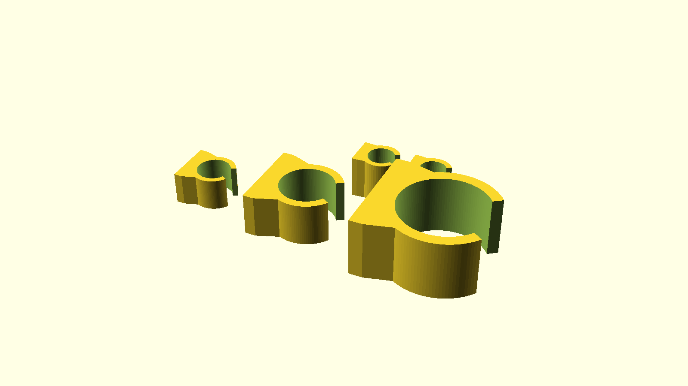

# lib.scad.clamps verification

Repository-level strategy/status: [50-00-verification.md](50-00-verification.md).

The verification tests use the public library APIs from separate consumer files
and build three clamps with different dimensions.

## OpenSCAD

- [STL export](openscad/tube-clamp-api.stl)

## PythonSCAD

- [STL export](pythonscad/tube-clamp-api.stl)

## What is verified

- separate external consumption of both implementations;
- independent parametrized clamp instances;
- public build API geometry;
- derived radius calculations;
- PNG rendering;
- STL export.
