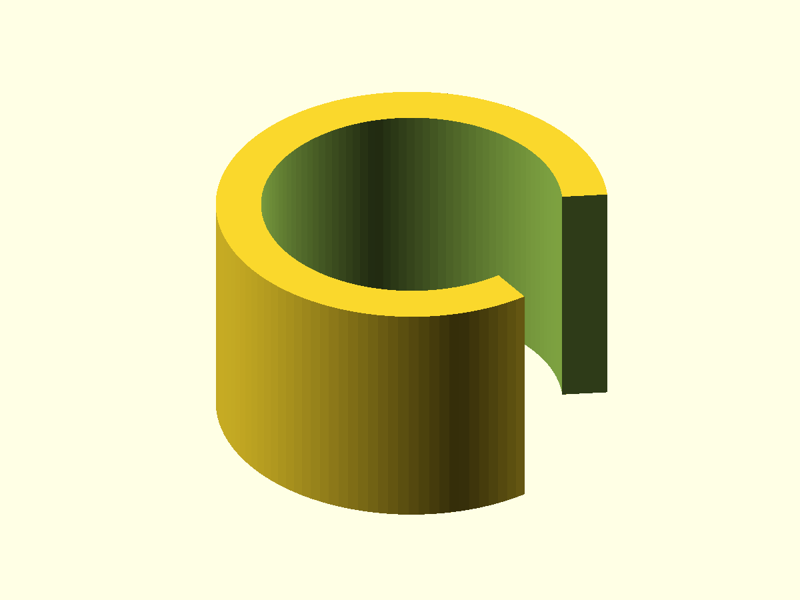
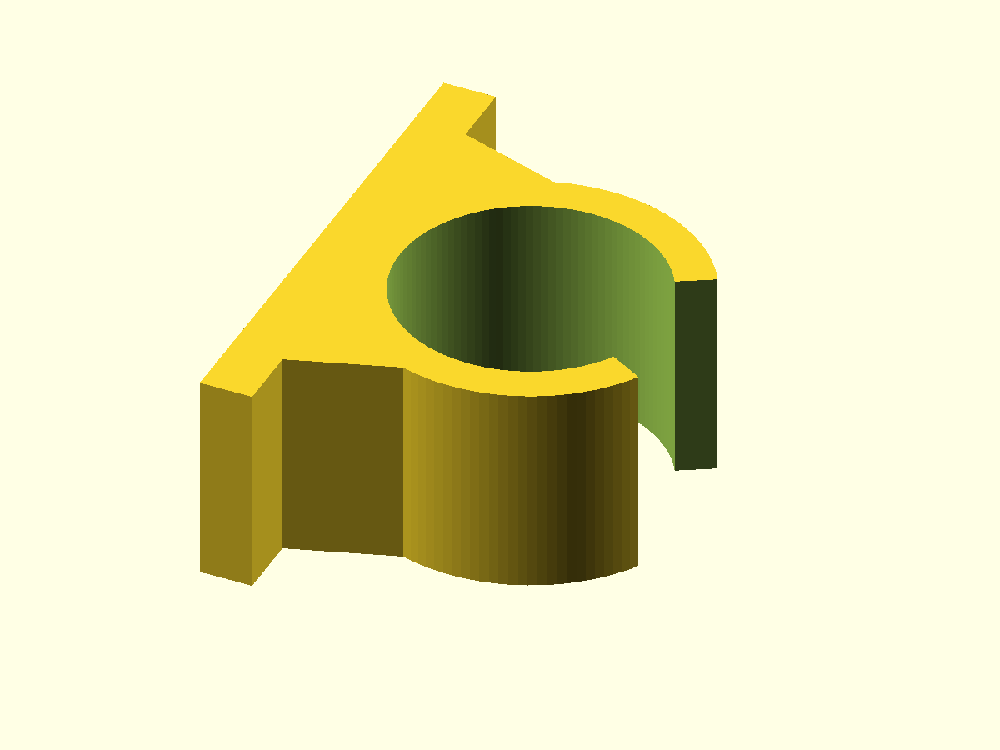

# Tube clamp — OpenSCAD design

## Purpose

The clamp is evolving from a bare C-shaped ring into a reusable mounting clip.

The first mounting feature is deliberately simple: a flat foot behind the clip
with a solid transition toward the circular body. The tube bore is then cut
through that transition, leaving two sloped side supports.

No screw holes or mounting-head details are part of this step yet.

## API shape

```scad
clamp = tube_clamp_create(...);

tube_clamp_build(clamp);
tube_clamp_render(clamp, view = TUBE_CLAMP_VIEW_OPENING);

inner_r = tube_clamp_inner_radius(clamp);
outer_r = tube_clamp_outer_radius(clamp);
```

The mounting geometry is part of the same clamp object:

```scad
clamp = tube_clamp_create(
    tube_diameter = 20,
    wall_thickness = 3,
    clamp_width = 16,
    opening_angle = 60,
    foot_length = 40,
    foot_thickness = 4,
    foot_transition_width = 30,
    foot_transition_height = 8
);
```

## 1. Full ring

Radius calculations remain independent of the mounting foot:

```scad
function tube_clamp_inner_radius(clamp) =
    (clamp.tube_diameter + clamp.clearance) / 2;

function tube_clamp_outer_radius(clamp) =
    tube_clamp_inner_radius(clamp)
    + clamp.wall_thickness;
```

The ring is positioned in front of the mounting surface so its outside overlaps
the foot slightly.

```scad
function _tube_clamp_center_x(clamp) =
    clamp.foot_thickness
    + tube_clamp_outer_radius(clamp)
    - FOOT_OVERLAP;
```


## 2. Opening cutter

The snap opening remains the same simple triangular cutter:

```scad
cutter_length = outer_r + 10;
cutter_half_width =
    cutter_length * tan(clamp.opening_angle / 2);
```

The cutter starts at the ring center and opens away from the mounting foot.


## 3. Clip body

Before adding mounting geometry, the ring and opening can still be inspected as
the original C-shaped clip body:

```scad
module _clip_body(clamp) {
    difference() {
        _full_ring(clamp);
        _opening_cutter(clamp);
    }
}
```



## 4. Flat mounting foot

The foot itself is a flat rectangular body. A trapezoidal transition connects
its front face to the circular outside of the clip:

```scad
polygon(points = [
    [clamp.foot_thickness, -base_half_width],
    [clamp.foot_thickness,  base_half_width],
    [attach_x,               attach_y],
    [attach_x,              -attach_y]
]);
```

The final geometry is built as one outer body first. The tube bore and opening
are subtracted afterwards:

```scad
difference() {
    union() {
        _outer_ring_solid(clamp);
        _mounting_foot(clamp);
    }

    _inner_bore_cutter(clamp);
    _opening_cutter(clamp);
}
```

Because the bore also cuts through the transition, the center remains open and
the transition becomes two simple sloped side supports.



## View selection

```scad
TUBE_CLAMP_VIEW_FINAL = 0;
TUBE_CLAMP_VIEW_RING = 1;
TUBE_CLAMP_VIEW_OPENING = 2;
TUBE_CLAMP_VIEW_CLIP_BODY = 3;
```

The Customizer uses the same numeric values.

## OpenSCAD object feature

The clamp data model uses OpenSCAD's experimental `object()` builtin. CLI
renders therefore explicitly enable:

```bash
openscad --enable=object-function ...
```
