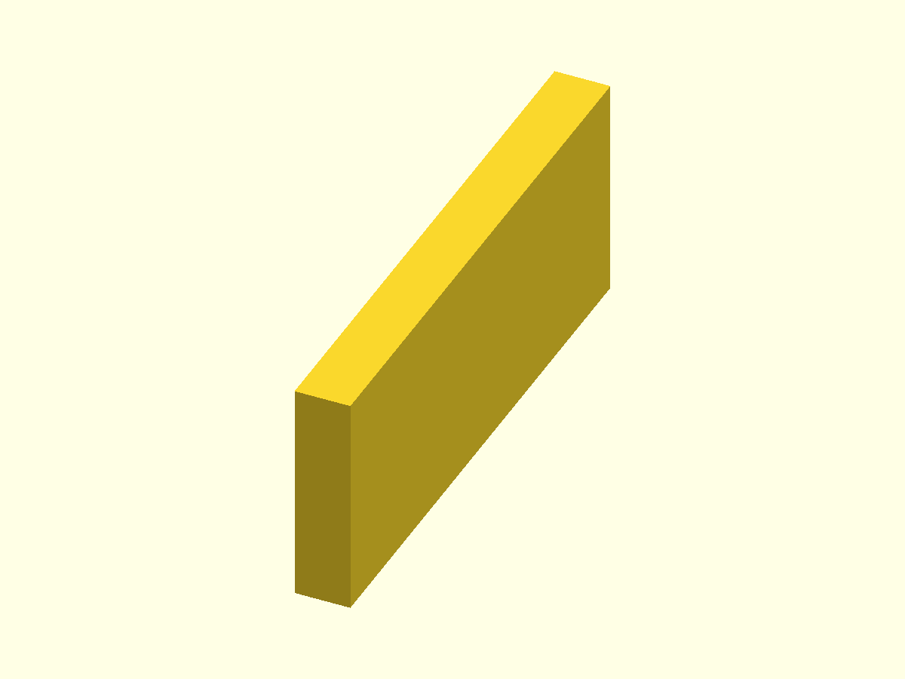
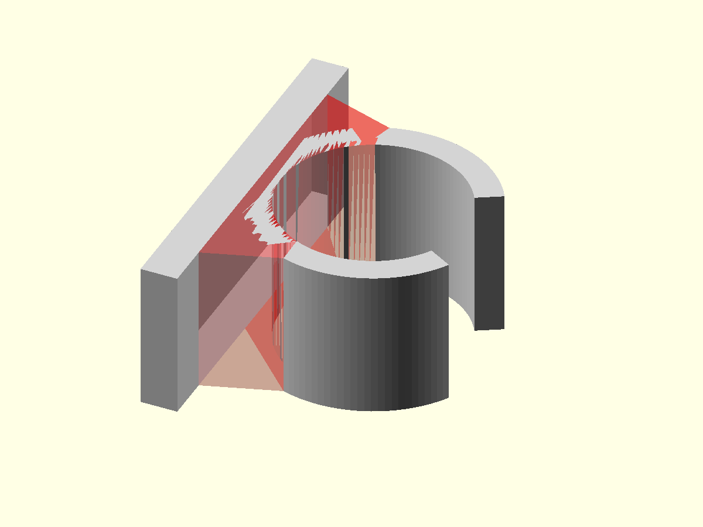

# Tube clamp — OpenSCAD design

## Design idea

The tube clamp is built up in a few visually separate steps.

The starting point is a C-shaped snap clip around the tube. A flat mounting
foot is then placed behind that clip. The foot provides the surface that can
later be attached to another part.

A direct 90-degree connection between the flat foot and the round clip would
look abrupt and would concentrate material in a small area. Therefore two
sloped side transitions connect the foot to the round outside of the clip.

At this stage the mounting foot is deliberately simple. There are no screw
holes, countersinks, nut traps or mounting variants yet.

The intended profile is roughly:

```text
             opening
                >
        .----------------.
      .'                  '.
     /        tube          \
    |          ○             |
     \                      /
      '.__              __.'
          \            /
           \          /       sloped transitions
            |        |
            |        |        flat mounting foot
            |________|
```

The following renders show those construction steps separately.

## Parameters introduced by the mounting foot

The clamp itself keeps its existing tube parameters. Four parameters now
describe the basic mounting geometry:

```scad
foot_length = 40;
foot_thickness = 4;
foot_transition_width = 30;
foot_transition_height = 8;
```

Their meaning is:

- `foot_length` — total length of the flat mounting surface, measured along
  the tube circumference direction;
- `foot_thickness` — distance from the mounting surface to the front face of
  the flat foot;
- `foot_transition_width` — width of the area on the foot from which the two
  sloped transitions start;
- `foot_transition_height` — how far those transitions extend from the flat
  foot toward the round clip.

The final profile render at the end is especially useful for judging these
dimensions together.

## 1. Start with a complete ring

The tube dimensions are derived from the requested tube diameter, clearance and
wall thickness.

```scad
function tube_clamp_inner_radius(clamp) =
    (clamp.tube_diameter + clamp.clearance) / 2;

function tube_clamp_outer_radius(clamp) =
    tube_clamp_inner_radius(clamp)
    + clamp.wall_thickness;
```


## 2. Define the snap opening

The opening is still made with the deliberately simple triangular cutter.

The ring stays neutral gray while the material to be removed is shown in
transparent red.

```scad
cutter_length = outer_r + 10;
cutter_half_width =
    cutter_length * tan(clamp.opening_angle / 2);
```


## 3. The C-shaped clip body

After subtracting the opening cutter, the basic snap clip is visible without
any mounting geometry.

This is the part we already had before adding the mounting foot.

```scad
module _clip_body(clamp) {
    difference() {
        _full_ring(clamp);
        _opening_cutter(clamp);
    }
}
```


## 4. Add the flat mounting foot

The first new mounting feature is just a rectangular foot.

It is intentionally shown on its own here so `foot_length` and
`foot_thickness` are not hidden by the round clip.

```scad
module _flat_foot(clamp) {
    translate([
        0,
        -clamp.foot_length / 2,
        0
    ])
        cube([
            clamp.foot_thickness,
            clamp.foot_length,
            clamp.clamp_width
        ]);
}
```



## 5. Connect foot and clip with sloped sides

The next step joins the flat foot to the circular body.

In this render the existing clip and foot are gray. The **new transition
material is transparent red**, so it is immediately visible what this step
adds.

The transition starts wide on the foot and narrows where it meets the round
clip.

```scad
polygon(points = [
    [clamp.foot_thickness, -base_half_width],
    [clamp.foot_thickness,  base_half_width],
    [attach_x,               attach_y],
    [attach_x,              -attach_y]
]);
```

The tube bore is removed from this transition as well. That leaves two sloped
supports rather than a solid block behind the tube.



## 6. Complete clamp

For the final part, the outside ring, flat foot and transition are first joined
into one body. The tube bore and snap opening are then removed from that
combined body.

```scad
difference() {
    union() {
        _outer_ring_solid(clamp);
        _mounting_foot(clamp);
    }

    _inner_bore_cutter(clamp);
    _opening_cutter(clamp);
}
```

The result is still the same snap clip at the front, but it now has a flat
surface behind it that can form the basis for later mounting features.


## 7. Profile view

The final render looks straight along the clamp width. This removes the
perspective effect and makes the relationship between the round clip, sloped
transitions and flat foot much easier to judge.

Use this image when changing:

- `foot_thickness`;
- `foot_transition_width`;
- `foot_transition_height`;
- the overlap between the round clip and the foot.


## Public API

The mounting parameters remain part of the same OpenSCAD object:

```scad
clamp = tube_clamp_create(
    tube_diameter = 20,
    clearance = 0.0,
    wall_thickness = 3,
    clamp_width = 16,
    opening_angle = 60,
    foot_length = 40,
    foot_thickness = 4,
    foot_transition_width = 30,
    foot_transition_height = 8
);

tube_clamp_build(clamp);
```

The object-based API remains the preferred direction for reusable OpenSCAD
components in this repository.

## Design views

```scad
TUBE_CLAMP_VIEW_FINAL = 0;
TUBE_CLAMP_VIEW_RING = 1;
TUBE_CLAMP_VIEW_OPENING = 2;
TUBE_CLAMP_VIEW_CLIP_BODY = 3;
TUBE_CLAMP_VIEW_FOOT = 4;
TUBE_CLAMP_VIEW_TRANSITION = 5;
TUBE_CLAMP_VIEW_SIDE = 6;
```

Command-line renders must continue to enable OpenSCAD's experimental object
functionality:

```bash
openscad --enable=object-function ...
```
