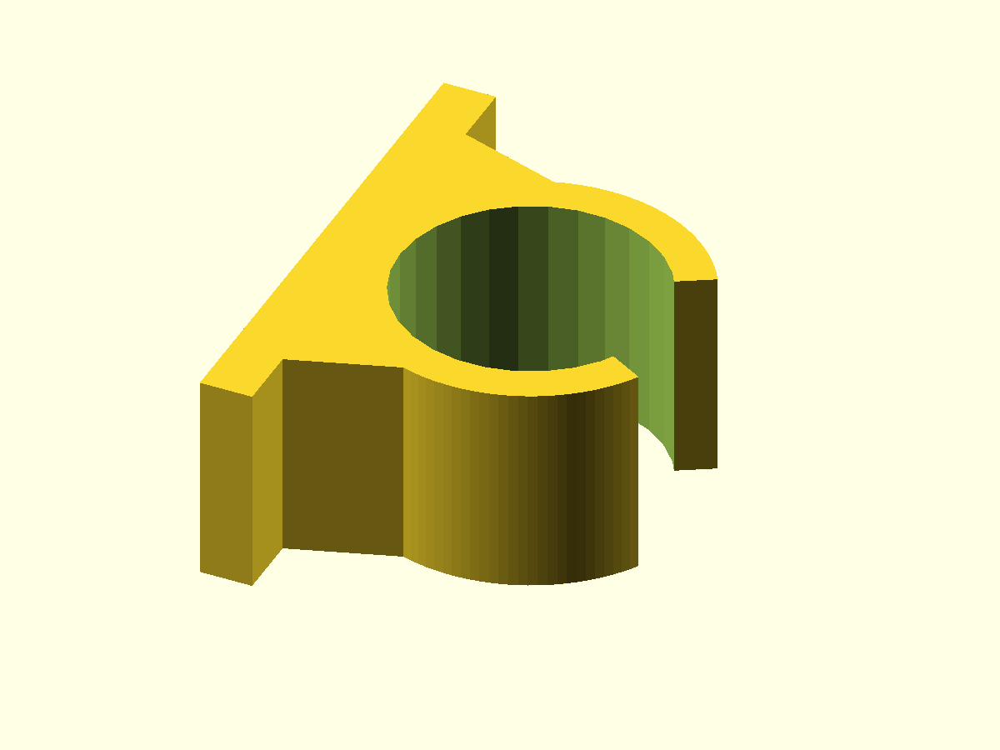
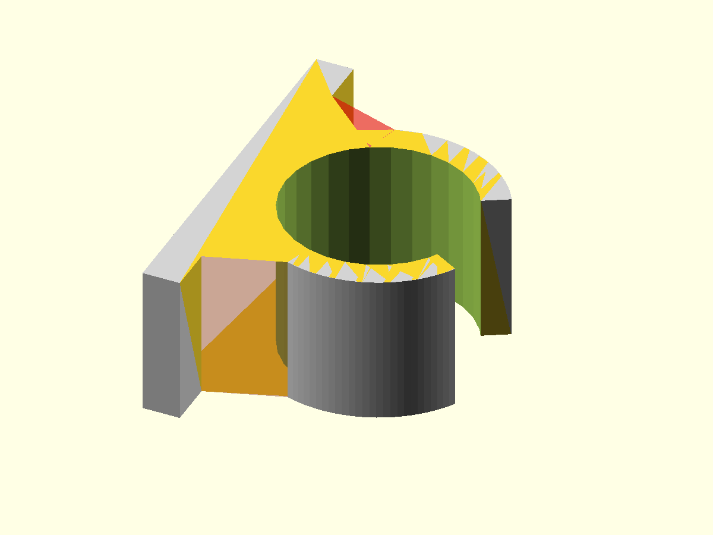
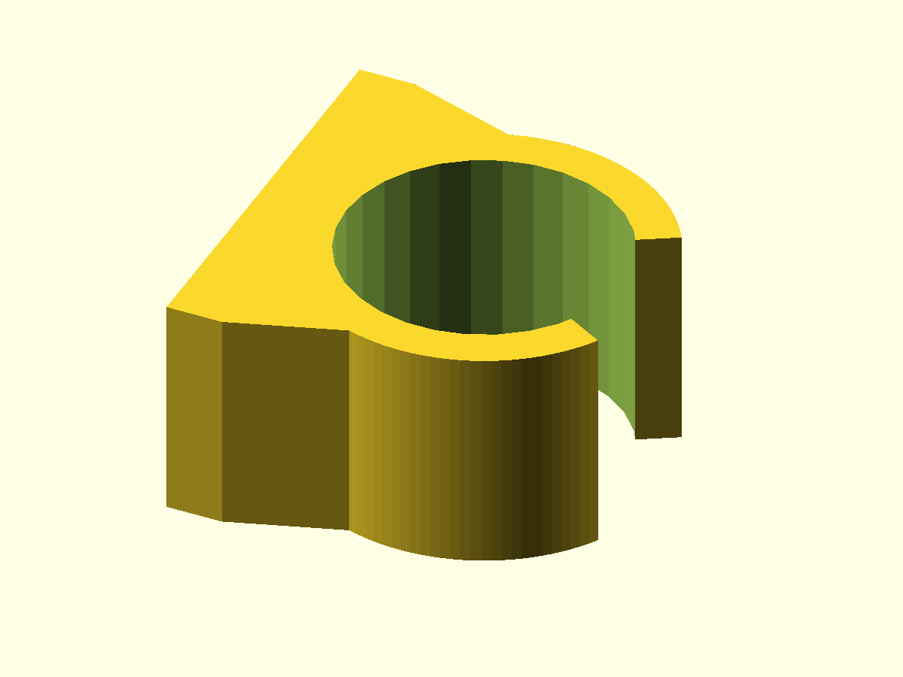

# Tube clamp — PythonSCAD design

## Design idea

This PythonSCAD implementation is retained as the comparison implementation of
the same `tube-clamp` design.

The geometry follows the same visual construction sequence as the OpenSCAD
version:

1. complete tube ring;
2. triangular snap-opening cutter;
3. C-shaped clip body;
4. flat mounting foot;
5. sloped transition from foot to round clip;
6. complete clamp;
7. profile view.

No screw holes or other mounting variants are part of this step yet.

## Mounting parameters

```python
foot_length: float = 40
foot_thickness: float = 4
foot_transition_width: float = 30
foot_transition_height: float = 8
```

- `foot_length` controls the total length of the flat mounting surface;
- `foot_thickness` controls how thick that flat foot is;
- `foot_transition_width` controls how wide the transition starts on the foot;
- `foot_transition_height` controls how far the transition reaches toward the
  round clip.

## 1. Full ring

```python
@property
def inner_radius(self):
    return (self.tube_diameter + self.clearance) / 2
```


## 2. Opening cutter

The construction view keeps the ring light gray and shows the triangular cutter
in transparent red.

```python
cutter_half_width = cutter_length * tan(
    radians(self.opening_angle / 2)
)
```


## 3. Clip body

```python
def _clip_body(self):
    return (
        self._full_ring()
        - self._opening_cutter()
    )
```



## 4. Flat mounting foot

The foot is shown separately before any transition is added.

```python
def _flat_foot(self):
    return cube([
        self.foot_thickness,
        self.foot_length,
        self.clamp_width,
    ]).translate([
        0,
        -self.foot_length / 2,
        0,
    ])
```


## 5. Sloped transition

The existing clip and foot are gray while the newly added transition supports
are transparent red.

```python
points = [
    [self.foot_thickness, -base_half_width],
    [self.foot_thickness, base_half_width],
    [attach_x, attach_y],
    [attach_x, -attach_y],
]
```

The tube bore is subtracted from the transition so it becomes two side supports
instead of a solid block.



## 6. Complete clamp

```python
outer_body = (
    self._outer_ring_solid()
    | self._mounting_foot()
)

return (
    outer_body
    - self._inner_bore_cutter()
    - self._opening_cutter()
)
```



## 7. Profile view

The render workflow looks directly along the clamp width. This makes the
foot thickness and transition geometry easier to understand than an isometric
view alone.


## Views

```python
class View(StrEnum):
    FINAL = "Final clamp"
    RING = "Full ring"
    OPENING = "Opening cutter"
    CLIP_BODY = "Clip body"
    FOOT = "Mounting foot"
    TRANSITION = "Foot transition"
    SIDE = "Side view"
```

OpenSCAD remains the primary implementation direction for future reusable
libraries. This PythonSCAD version is maintained as the existing technology
comparison.
