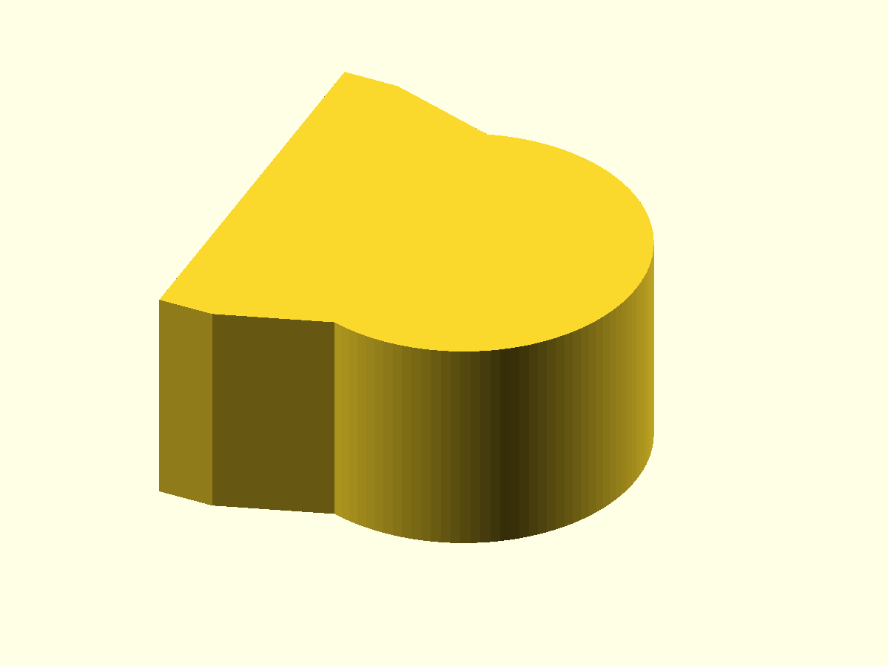
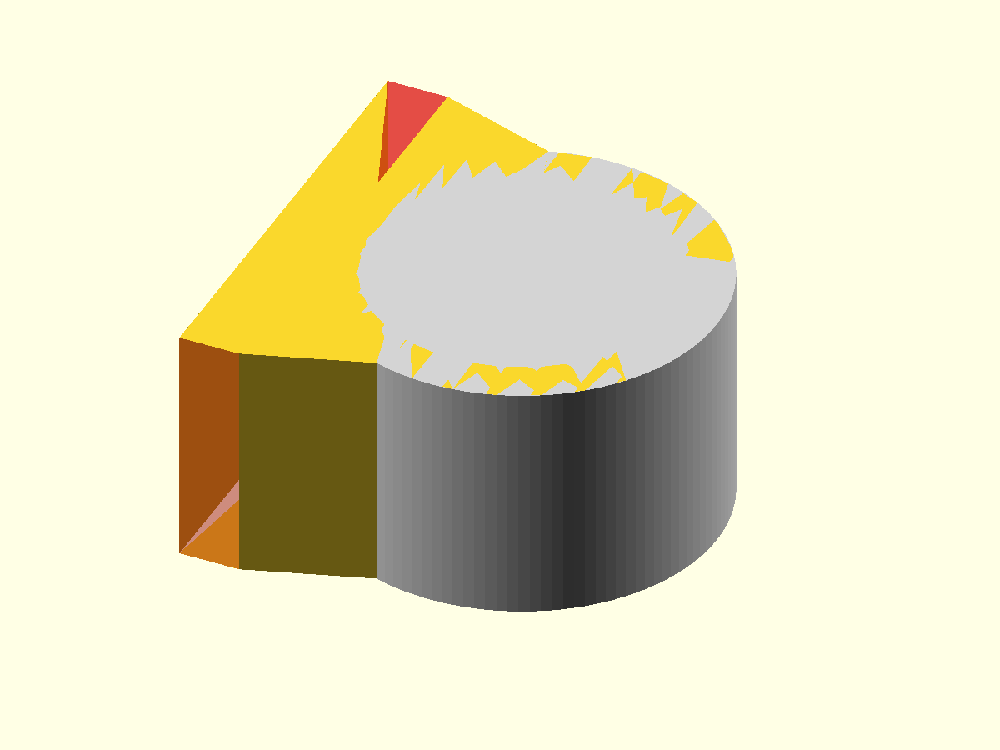
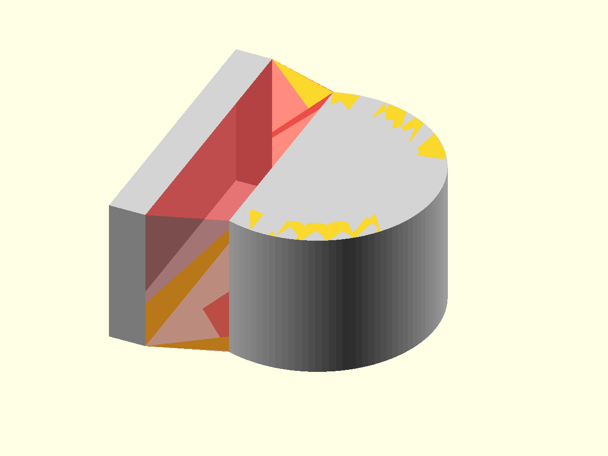
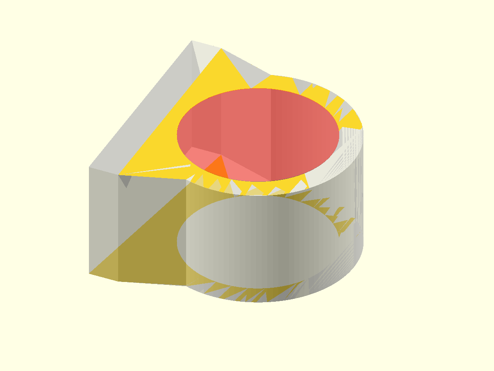
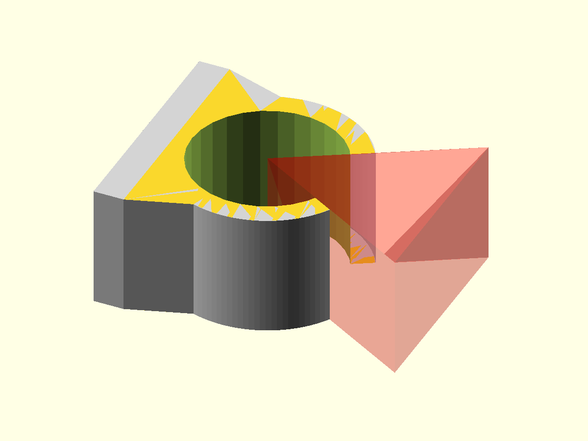

# Tube clamp — PythonSCAD design

## Scope

This is the retained PythonSCAD comparison implementation of the same reusable
base clip.

The flat back is deliberately compact. Its width is exactly
`transition_width`; it is not an extended mounting plate.

```python
base_thickness: float = 4
transition_width: float = 30
transition_depth: float = 8
```

The Boolean construction order matches the OpenSCAD implementation:

```text
complete outside shape
        ↓
tube bore
        ↓
snap opening
        ↓
final clip
```

## 1. Solid circular outside

The design starts with a solid outside cylinder. The tube cavity is not cut yet.



## 2. Compact base

The new base is transparent red. Its width comes directly from
`transition_width`.

```python
def _flat_base(self):
    return cube([
        self.base_thickness,
        self.transition_width,
        self.clamp_width,
    ])
```



## 3. Sloped transition

The transition joins the flat back to the circular outside. At the end of this
step the model is one complete solid outside shape.

```python
def _outer_shape(self):
    return (
        self._outer_ring_solid()
        | self._flat_base()
        | self._base_transition()
    )
```



## 4. Tube bore

The tube cavity is removed once from the completed outside.

```python
self._outer_shape() - self._inner_bore_cutter()
```



## 5. Snap opening

The triangular snap-opening cutter is applied after the tube cavity.



## 6. Final base clip

```python
def build(self):
    return (
        self._outer_shape()
        - self._inner_bore_cutter()
        - self._opening_cutter()
    )
```


## 7. Profile view

This view removes perspective and is intended for judging the base and
transition geometry.


## Possible later variants

The base clip remains mounting-neutral. A later variant may add one screw
below the tube or extend the base into a two-hole mounting plate.

No mounting variants are implemented in this step.

OpenSCAD remains the primary implementation direction for future reusable
libraries; this PythonSCAD version remains only as the existing comparison
implementation.
