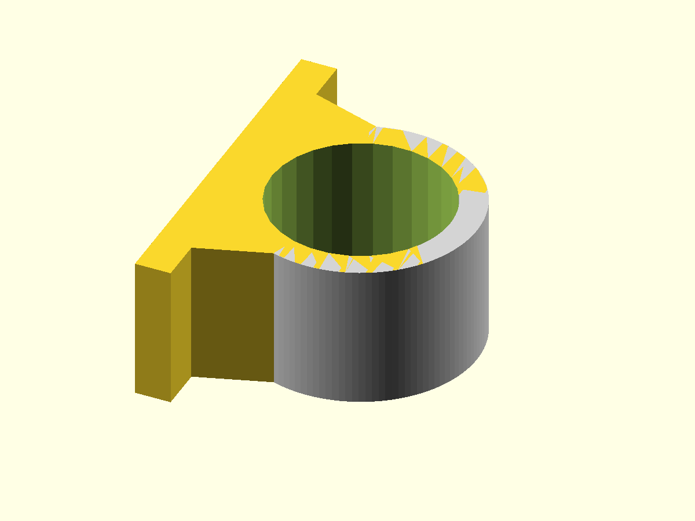
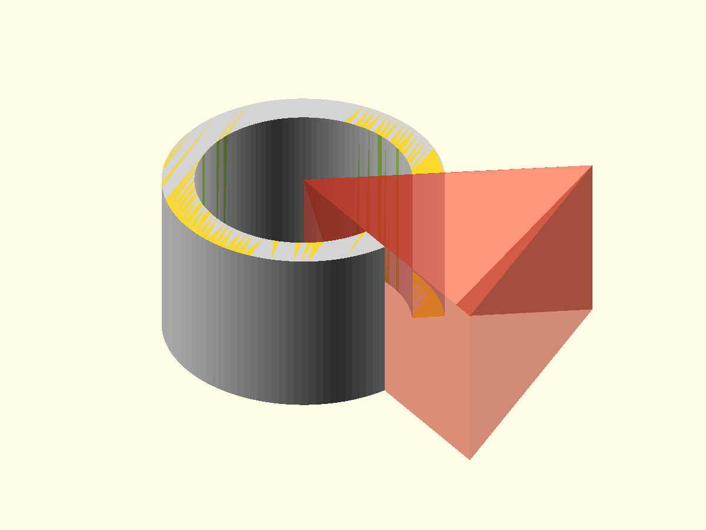
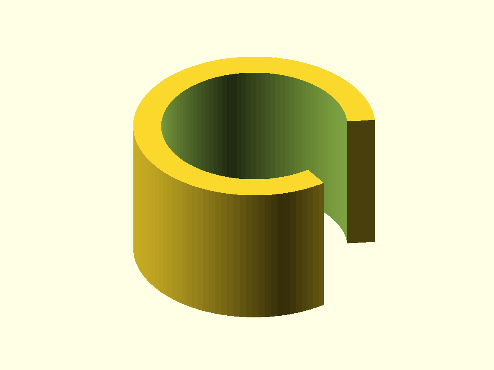

# Tube clamp — PythonSCAD design

## Purpose

This is the PythonSCAD implementation of the same reusable open tube-clamp
design as the OpenSCAD implementation.

The design intent is shared, while the implementation uses normal Python
functions and solid-object composition. This makes the repository useful for
comparing the two approaches without changing the intended part.

## Functional parameters

| Parameter | Default | Meaning |
| --- | ---: | --- |
| `TUBE_DIAMETER` | 20 mm | Nominal outside diameter of the tube. |
| `CLEARANCE` | 0.0 mm | Diametral extra space around the tube. |
| `WALL_THICKNESS` | 3 mm | Radial thickness of the clamp body. |
| `CLAMP_WIDTH` | 16 mm | Width along the tube axis. |
| `OPENING_ANGLE` | 60° | Angular sector removed from the ring. |

## Geometry construction

The PythonSCAD implementation follows the same three design operations:

```text
full ring
   ↓
opening cutter
   ↓
ring - cutter
   ↓
final tube clamp
```

The excerpts below show the essential implementation. The complete source
remains in [`tube-clamp.py`](../tube-clamp.py).

## 1. Full ring

The full ring is created by subtracting an inner cylinder from an outer
cylinder.

```python
def full_ring(...):
    inner_radius = (tube_diameter + clearance) / 2
    outer_radius = inner_radius + wall_thickness

    outer = cylinder(
        h=clamp_width,
        r=outer_radius,
        fn=120,
    )

    inner = cylinder(
        h=clamp_width + 0.1,
        r=inner_radius,
        fn=120,
    ).translate([0, 0, -0.05])

    return outer - inner
```

As in the OpenSCAD version, the inner cylinder is extended slightly in Z to
avoid coincident subtraction faces.



## 2. Opening cutter

Python is used to generate the points of the opening sector. The resulting 2D
polygon is then extruded into the cutter solid.

```python
def opening_cutter(...):
    points = _sector_points(
        outer_radius + 2 * wall_thickness + 1,
        opening_angle,
    )

    return polygon(points).linear_extrude(
        height=clamp_width + 0.1
    ).translate([0, 0, -0.05])
```

This is a useful implementation difference to compare with OpenSCAD: the
sector-point generation is ordinary Python logic while the resulting geometry
is still expressed as PythonSCAD solids.



## 3. Final clamp

The final part mirrors the OpenSCAD design relationship directly:

```python
def tube_clamp(...):
    return full_ring(
        tube_diameter,
        wall_thickness,
        clamp_width,
        clearance,
    ) - opening_cutter(
        tube_diameter,
        wall_thickness,
        clamp_width,
        opening_angle,
        clearance,
    )
```

The readability of this solid-object expression is one of the aspects this
library is intended to compare with the equivalent OpenSCAD construction.



## Design views

The same Python source is used for both the final model and the design
documentation views.

A small selector returns the geometry to render:

```python
def design_object(view):
    if view == "01-ring":
        return full_ring()

    if view == "02-opening":
        return opening_cutter()

    if view in ("final", "03-final"):
        return tube_clamp()
```

The render workflow selects a view with the `DESIGN_VIEW` environment variable:

```bash
DESIGN_VIEW="02-opening" xvfb-run -a pythonscad   --render   --trust-python   -o design/img/02-opening.png   tube-clamp.py
```

Using the production source for documentation views prevents a parallel set of
documentation-only geometry from drifting away from the actual part.

## Keeping design and code in sync

`design.md` is maintained as part of the implementation.

For every meaningful geometry change:

1. update `tube-clamp.py`;
2. update the corresponding construction explanation and essential code excerpt;
3. regenerate the design images;
4. review code, documentation and generated images as one design change.

The generated PNGs are updated automatically by GitHub Actions when they
change. The Markdown explanation is intentionally maintained together with the
source code by the developer or AI assistant making the design change.

## Comparison with OpenSCAD

The two implementations should preserve the same design intent, but they do not
need to use identical internal code structures.

The comparison should focus on:

- clarity of the geometry construction;
- parameter handling;
- ease of producing documentation views;
- suitability for reusable library code;
- automated verification of equivalent output.

## Verification target

The OpenSCAD and PythonSCAD implementations should ultimately be verified for
equivalent:

- nominal bounding box;
- inner tube diameter;
- outer diameter;
- clamp width;
- opening angle;
- exported mesh volume within a defined tolerance.
